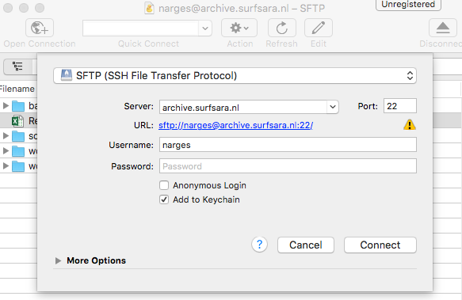
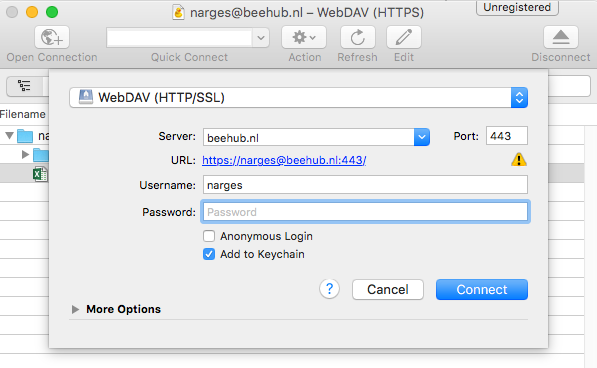

#Demo: Archive usage via Cyberduck
To transfer data to the Archive using Cyberduck, you first need to install the software. Cyberduck is only avaiable for windows and Mac machines.

- Go to **https://cyberduck.io/?l=en**
- Download the software for your machine (Windown or Mac) 
- Open Cyberduck

## Transfer data to and from the Archive
To transfer data from your computer to the archive choose: **SFTP (ssh file transfer protocol)**. For the server name type: 
**archive.surfsara.nl** and port **22**. Enter your user name and password and click connect.
After connecting simply drag and drop files from your computer to Cyberduck or vice versa. The files will be transfered automatically. 

Note: If the data is on tape, it first needs to be staged before it can be used. If the data is not staged, Cyberduck can't access the data the connection will be timed-out (and you will receive a Broken-pipe Exception). Therefore Cyberduck is better for dumping data into the archive, rather than fetching data.

<!--
```
archive.surfsara.nl
```-->





##Transfer Data between Services 
You can use cyberduck to transfer data from one service to the other, for example from Beehub to the Archive or Lisa.
For this you should open two connection windows in Cyberduck (ctrl+N). Connect one to the Archive (showed in previous step) and the other to the Beehub service.

To connect to BeeHub use: **WebDAV(HTTP/SSL)** protocol, server name: **beehub.nl** and posr **433**. Connect with entering your user credentials.

After both connections are established, simply drag and drop files from one window to the other to transfer file between services.





##Advantages and Drawbacks

There are some advantages and disadvantages in using GUI for transferring data.

**Advantages:**

- Easy data transfwr to archive using graphical user interface

- Can be accessed from Windows, Mac and linux machines.

- Good for dumping data to the archive, and not fetching data


- Transfer data between services (Only possible for small data)

**Drawbacks:**

- You can't see the status of the data (i.e. weather the data is on disk or on tape).

- Does not support 3rd party transfer and the data flows via the user laptop. Therefore, transfer depends on your local storage and connectivity. If the connection is lost, the transfer is lost.

- Works only for small data files 

